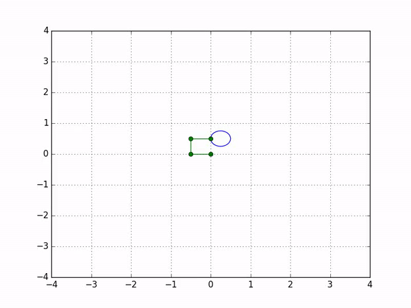
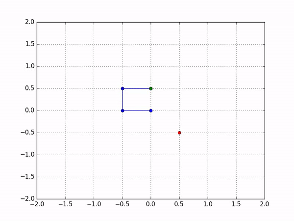

# n-dof-manipulator
A Python simulator for n-dof robotic manipulators based on the Denavit-Hartenberg convention ([Robotics: Modelling, Planning and Control](https://books.google.co.in/books/about/Robotics.html?id=VsTOQOnQjCAC&source=kp_book_description&redir_esc=y)).

`DH_trajectory_follower.py` demonstrates implementation for trajectory following.

`DH_pick_and_place.py` demonstrates implementation for pick and place.

### Trajectory Following

### Pick and Place

